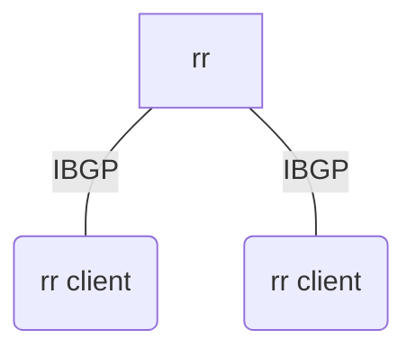

# IBGP

书接上文 [OSPF](/connect/ospf.html)，本篇着重解决此前提到的第二个问题，EBGP 外部路由在 AS 内部的转发。

## IBGP

IBGP 和 EBGP 其实很相似，最大的不同点是他一般只传播一次，即通过 IBGP 收到的路由不会被转发到其他 IBGP Peer。所以如果使用纯 IBGP 完成同步外部路由到内网所有路由设备的任务，那么就需要把 IBGP 配置成 fullmesh 的形状，也就是说每一个节点和其他所有的节点都需要做 Peer。

为什么 IBGP 只能传播一次呢，我的理解下是为了防止产生环。EBGP 有 AS-PATH，可以用来发现路径有有没有自己从而防止产生环路，而 IBGP 在一个 AS 内部传播，就没有 AS-PATH 一说了，人们于是就需要一个别的机制来防止环路的产生。

那么我们 IBGP 只能做 fullmesh 吗？显然不可能，后来人们端出了 RR 反射器 (Route Reflector)，可以允许部分节点对收到的 IBGP 路由做一个转发，从而大幅减少 IBGP 的配置量。

如果您是初学者，这里诚挚推荐您从双节点做 IBGP fullmesh 开始。

## IBGP fullmesh 

以双节点为例

```bird
template bgp ibgp_peers {
    # change it
    local as 4220084444;
    # change it
    source address 172.16.4.6;
    ipv4 {
        next hop self ebgp;
        igp table OSPF_table;
        table BGP_table;
        import all;
        export filter {
            if source != RTS_BGP then reject;
            accept;
        };
    };
}

# change it
protocol bgp IBGP_xxx from ibgp_peers {
    neighbor 172.16.4.5 internal;
}
```

其实和 EBGP 非常相似，前面的 `local`和 `source address`和EBGP保持一致。

在 ipv4 块，我们添加了一句 `next hop self ebgp` 也就是对所有收到的 ebgp 路由设置自己为下一跳网关，由于 AS 内部的 OSPF 已经跑通了，所以设为自己的递归路由一下就可以通过 OSPF 的表找到下一跳网关的位置。下面紧接着的 `igp table OSPF_table`就是对于接收到的 IBGP 路由 bird 去搜索递归路由用的路由表，我们给他设置为我们 OSPF 的表。

至于为什么这里突然提到了递归路由，这是因为我们把路由通过 IBGP 通告到了我们的 AS 内部后其实这个路由的网关往往并不能直接路由得到。当我们收到一个 IBGP 路由后我们需要根据 OSPF 表做递归路由从而决定真正的下一跳地址。

再往后我们在 `export` 里做了一个过滤拒绝了非 BGP 路由，这是因为我们静态宣告自己的网段是 Static 路由做的。而 IBGP 从设计上来说，并不适用于传递这些信息，更何况对于内部而言这是错误的，因此这里做一个过滤。

最后我们依旧和使用 EBGP 一样，根据上面的模板定义一个新的 IBGP 连接，不同的是现在不需要指定接口，**也不要写隧道IP**，填写目标路由器本身的IP即可，IBGP 的 peer 默认是 multihop 的，他会自己根据路由表路由过去，最终连上就可以了，后面标识 internal 表示这是一个 IBGP。

### 继续增加节点

这里涉及三个协议，OSPF IBGP EBGP。对于 OSPF 增加节点只要有一条隧道通上就好了。EBGP 照样配就是，尽可能就近 peer。而 IBGP，你每增加一个节点，这个节点要和现存的所有节点 peer。

想必大伙也发现了，如果节点数量上来了，IBGP fullmesh 实在是过于繁琐，这就引出了 RR。

## RR

rr（Route Reflector）实际上是在 IBGP 上开洞，允许部分路由器收到的路由进行反射。

这些允许进行反射的路由器，我们称之为 rr server，也简称 rr；相对应的，连接到 rr server 的，需要通过反射获取路由的路由器，我们称之为 rr client。



rr 的反射规则只有三条：

- 从非客户机学到的路由，发布给所有客户机（rr client）。
- 从客户机学到的路由，发布给所有非客户机和客户机（发起此路由的客户机除外）。
- 从EBGP对等体学到的路由，发布给所有的非客户机和客户机。

三条规则中还提到了一个"非客户机"的概念，实际上指的是连接到 rr 的非 rr client 的 IBGP peer，我们后续在多级 rr 和冗余 rr 中会再一次提到。

> 参考华为关于 rr 的[产品文档](https://info.support.huawei.com/hedex/api/pages/EDOC1100210440/AZK0901G/09/resources/dc/dc_feature_bgp_0008.html)

下面以单 rr 为例给出 rr server 的配置文件。

:::warning
只部署了一个 rr 意味着 rr 节点掉线后整个网络去往其他自治域的路由都会消失，建议冗余 rr 起步
:::

```bird
template bgp ibgp_peers {
    # change it
    local as 4220084444;
    # change it
    source address 172.16.4.6;
    ipv4 {
        next hop self ebgp;
        igp table OSPF_table;
        table BGP_table;
        import all;
        export filter {
            if source != RTS_BGP then reject;
            accept;
        };
    };
}

# change it
protocol bgp IBGP_xxx from ibgp_peers {
    neighbor 172.16.4.5 internal;
    rr client;
}
```

可以发现，其实只加了一句话 `rr client;` 用于标记对端是一个 rr client。

rr client 配置文件无需改动。

## 冗余 RR

单 rr 的可靠性肉眼可见的差，我们需要冗余 rr 来帮助提高网络的可用性。


可以看到冗余 rr 的整体架构是将所有的 rr client 连接到所有的 rr，并且在 rr 之间也起一个 IBGP 用于交换 rr 本身的其他 BGP 路由。

在讲解配置之前，需要先引入两个概念，分别是 Originator ID 和 Cluster List。

rr 在反射的时候会给 BGP 路由添加 Originator ID 属性用于标记一条路由的最初出现的路由器的 Router ID 用于产生防止环路。路由器在通过 IBGP 收到 Originator ID 为自身 Router ID 的路由时会忽略它。

rr 在反射的时候还会 BGP 路由的 Cluster List 属性的前面添加自己的 Cluster ID，多见于多级 rr 用于 Cluster 间防环，RR 在通过 IBGP 收到 Cluster List 中存在自身 Cluster ID 的路由时会忽略它。

在冗余 rr 中需要特别注意的是，**所有的 rr 的 Cluster ID 必须一致**，否则很容易产生环路。

> 话又说回来，有 Originator ID 保着其实不会真的环上，只会让 IBGP 路由条数变多几倍，具体几倍取决于冗余 RR 数量。

下面继续给出配置样例。

```bird
# RR1
template bgp ibgp_peers {
    # change it
    local as 4220084444;
    # change it
    source address 172.16.4.6;
    # change it
    rr cluster id 172.16.4.6;
    ipv4 {
        next hop self ebgp;
        igp table OSPF_table;
        table BGP_table;
        import all;
        export filter {
            if source != RTS_BGP then reject;
            accept;
        };
    };
}

# change it
protocol bgp IBGP_RR_xxx from ibgp_peers {
    neighbor 172.16.14.1 internal;
}

# change it
protocol bgp IBGP_xxx from ibgp_peers {
    neighbor 172.16.4.5 internal;
    rr client;
}
```

整个配置文件只有两处改动

1. 添加了 `rr cluster id`，这里取值为冗余 rr 中的一个 rr 的 Router ID，需要注意互为冗余的 rr 之间的 Cluster ID 需要保持一致。
2. 添加了 `protocol bgp IBGP_RR_xxx`，用于 fullmesh 对接到其他 RR 交换 RR 本身的其他 BGP 路由。


## 多级 RR

DN11 还用不上，可以参考前面提到的华为产品文档学习以加深对 rr 的理解。

## 思考题

1. 在单级冗余双 rr 场景下，如果两个 rr client 分别和一个 rr 断开连接，请问他们能否交换 EBGP 路由？如果能请阐述链路，如果不能请解释原因。

::: details 题解
不能，虽然 rr 将从 rr client 收到的路由传递给其他 rr ，但在冗余 rr 场景下，rr 之间的 cluster_id 相同，在向对端传递路由时会被对端拒绝。
:::

## 疑难解答

### 一堆 unreachable

检查 igp table 配了没，检查 ospf 路由表是否正确。
