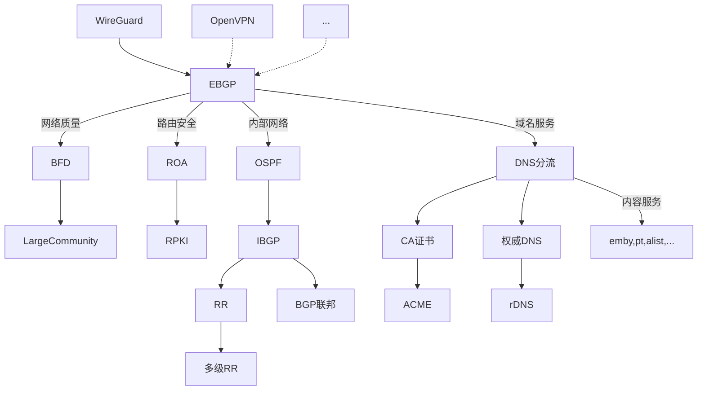

# Hello DN11

DN11全称为 “11号去中心化网络”（Decentralized Network 11），~~围绕杭电11楼建设~~。也接纳来自其他宿舍楼其他院校的同志。

目前主要采用[WireGuard](https://www.wireguard.com/)接入，后续应该会开放IKEv2等协议的接入，方便其他同学接入。

按照愿景，每个自治域（默认以寝室为单位）都会分配到172.16.x.0/24这样的一个网段，因此，DN11目前设计上最多接纳255个主要节点接入。

关于接入DN11，请参照wiki和群友博客操作

<!-- 接入后可以[加群](https://jq.qq.com/?_wv=1027&k=wlfajEoS)来吹水 -->

[DN11信息表](https://github.com/dn-11/metadata/blob/main/README.md)

新同学修网 RoadMap

