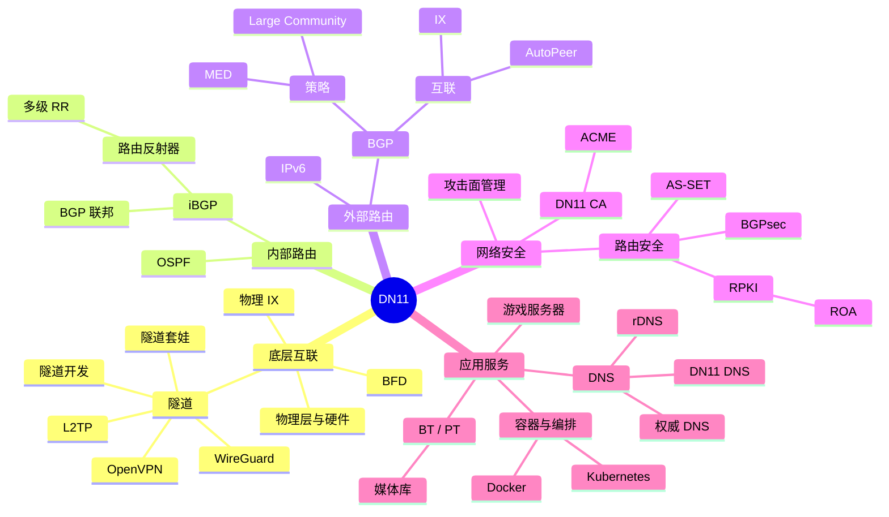

# DN11：11 号去中心化网络

DN11（Decentralized Network 11） 全称「11 号去中心化网络」，得名于其发源地——杭州电子科技大学 11 号宿舍楼。最初由 11 楼的同学发起，如今已汇聚起来自校内众多计算机网络爱好者，

## 从零开始，重走互联网发展之路

在 DN11，我们不满足于仅仅「使用」互联网，而是想和一群志同道合的同学一起，从两手空空开始，购买设备并重新搭建互联网，一起重走互联网发展路:

- **构建底层互联**：从隧道开始，逐步配置各类路由协议，将分散的节点连结成一张由我们自主维护的全球网络。
- **重现 Web1 的精神**：回溯早期万维网，从 DNS、静态页面开始，亲手搭建 Web 服务。通过自建门户页、站点目录以及搜索引擎，重新编织整个网络的联系。
- **探索 Web2 与 Web3 的可能**：在这张自有的底层网络之上，一起尝试构建去中心化的应用、平台与社区，重新思考互联网应当是什么样的。

## 自由探索，广阔天地

DN11 是一个开放、自由的网络实践社区。计算机网络并非只关乎网页，而是覆盖了从电磁波到应用程序的整套体系。无论你对哪一层感兴趣，都欢迎你带着想法加入实践：

- **物理层与链路层**：如果你对无线通信、射频或硬件感兴趣，不妨从最简单的八木天线开始，动手搭建无线链路，甚至为 DN11 定制专属的链路层方案。
- **路由与交换**：如果你对网络拓扑与选路感兴趣，我们可以一起研究 IGP、EGP、BGP、Babel 等路由协议以及多种 Peer 策略，一起思考各种选路策略给整个网络带来的影响，竭尽全力在复杂的网络环境下优化 DN11 的整体连通性。
- **隧道与代理**：如果你对隧道技术感兴趣，欢迎一起对比现有协议的设计思路，并有机会参与编写高性能、轻量化或场景定制化的隧道与代理实现。
- **网络开发与自动化**：如果你热衷于写代码解决实际问题，我们可以一起将 DN11 的日常需求转化为工具，包括但不限于自动打洞、AutoPeer、快速 DDNS、节点发现与拓扑可视化等。
- **应用、内容与基础设施**：如果你更倾向于 Web、服务端或内容建设，也可以为 DN11 搭建导航、状态页、镜像站、内部服务等各类基础设施。

...

下面展示的是当前 DN11 正在探索的一些技术，可以更具体地帮您了解我们正在做什么。

```mermaid
mindmap
    root((DN11))
        底层互联
            隧道
                WireGuard
                OpenVPN
                L2TP
                隧道套娃
                隧道开发
            BFD
            物理层与硬件
            物理 IX
        内部路由
            OSPF
            iBGP
                路由反射器
                    多级 RR
                BGP 联邦
        外部路由
            BGP
                策略
                    Large Community
                    MED
                互联
                    AutoPeer
                    IX
            IPv6
        网络安全
            路由安全
                RPKI
                    ROA
                AS-SET
                BGPsec
            攻击面管理
            DN11 CA
                ACME
        应用服务
            DNS
                DN11 DNS
                权威 DNS
                rDNS
            容器与编排
                Docker
                Kubernetes
            BT / PT
                媒体库
            游戏服务器
```
## 加入 DN11

- 如果您是杭州电子科技大学的学生，您可以在 [Github](https://github.com/dn-11/registry) 直接提起 pr，我们会通过 pr 中的 contact 字段内容与您取得联系，并核验您的身份
- 如果您不是杭州电子科技大学的学生，但您有一个朋友在 DN11，您可以委托他邀请您加入
- 此外，非常抱歉 DN11 暂无邀请您加入的计划