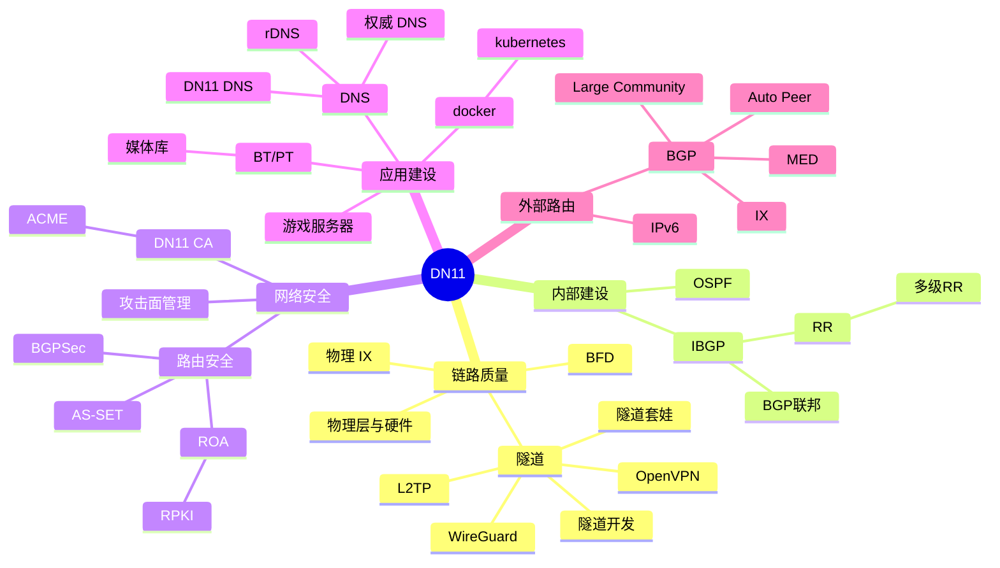

# Hello DN11

DN11全称为 “11号去中心化网络”（Decentralized Network 11），得名于其发源地杭电11楼，不过也接纳来自其他宿舍楼其他院校的同志。

在 DN11 您可以和一群热爱计算机网络的同学们一起，从两手空空开始购买设备并重新搭建互联网，重走互联网发展路，我们一起。

您可以亲手从隧道开始，逐步搭建各种静态路由，动态路由，并在此基础上从根服务器开始重新搭建 DNS；您还能从早期 Web1 时代开始，搭建属于自己的 Web 服务，并通过门户页，搜索引擎开始重新建立整个网络的联系；在未来我们也会一起探索在 DN11 重新发展 Web2、Web3 的可能性。

当然 **DN11 是自由的，计算机网络的世界是宽广的**。DN11 并不局限于 Web 内容的发展。

如果您对通信以及硬件感兴趣，我们也鼓励您从最简单的八木天线开始制作属于自己的物理层，同时也有机会给他们定制一个链路层；

如果您对路由交换感兴趣，我们也可以一起研究内部外部的各种路由协议和 Peer 方式，一起思考各种选路策略给整个网络带来的正面以及负面影响，竭尽全力在复杂的网络环境下优化 DN11 的整体连通性；

如果您对隧道和代理感兴趣，我们也欢迎您来一起讨论各种协议之间的区别，您还有机会同我们一道编写各种高性能或场景定制化隧道代理协议；

如果您对网络开发等方向感兴趣，我们也欢迎您来一起将 DN11 内的各种需求进行集成以及开发，包括但不限于自动打洞、AutoPeer、快速 DDNS...;

...

下面展示的是当前 DN11 正在探索的一些技术，可以更具体地帮您了解我们正在做什么。

```mermaid
mindmap
    root((DN11))
        链路质量
            隧道
                WireGuard
                OpenVPN
                L2TP
                隧道套娃
                隧道开发
            BFD
            物理层与硬件
            物理 IX
        内部建设
            OSPF
            IBGP
                RR
                    多级RR
                BGP联邦
        网络安全
            路由安全
                ROA
                    RPKI
                AS-SET
                BGPSec
            攻击面管理
            DN11 CA
                ACME
        应用建设
            DNS
                DN11 DNS
                权威 DNS
                rDNS
            docker
                kubernetes
            BT/PT
                媒体库
            游戏服务器
        外部路由
            BGP
                Large Community
                MED
                Auto Peer
                IX
            IPv6
```

## 加入 DN11

- 如果您是杭州电子科技大学的学生，您可以在 [Github](https://github.com/dn-11/registry) 直接提起 pr，我们会通过 pr 中的 contact 字段内容与您取得联系，并核验您的身份
- 如果您不是杭州电子科技大学的学生，但您有一个朋友在 DN11，您可以委托他邀请您加入
- 此外，非常抱歉 DN11 暂无邀请您加入的计划